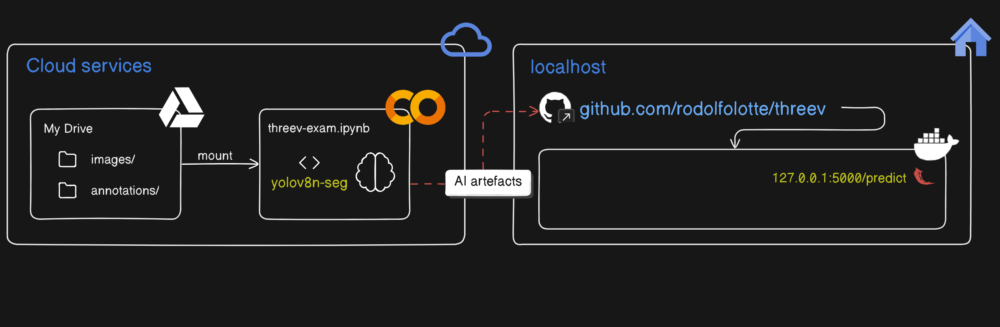

# ThreeV ML Assignment

# ML Assignment 
This solution was organized and coded by Rodolfo G. Lotte in agreement to the ThreeV candidate process.

# The test
You are given this dataset for Segmentation, please create a segmentation model, you may choose to use any Deep learning model, you may or may not use annotations for model training.

Every approach is valid, as long as you can explain the reason behind it. Using detectron or segment anything model is not allowed though!

Once done with model training, (Model doesn't have to beat all the benchmarks, but should be closer to the top 10s), please deploy this model as a web service/End point on a local docker container.

We are expecting the following from this assignment:
- Jupyter notebook with model training code (you may use colab if you want);
- DockerFile for this mini deployment;
- Demoable Model working end point on your local. We won't hit this end point, we just need to see it working on your local.

Please put this solution in the `github`, and share it with us when ready. Proper documentation of your approach in a README is important.

You get 5 days to do this, starting from the date you have received this document. Please email `nickb@threev.ai` for any questions you may have.

# Resolution
The solution was designed with two features, locally and with Cloud resources for training. The resources in Cloud were pretty much the Colab environment, where the file `threev_exam.ipynb` was used to perform the training. Some adaptations were made in order to perform the training over a non-squared images dataset. Besides, the model chose was the Ultralytics YOLOv8, which also has some particular setup to run over customized data. The big picture of the solution can be seen below:


## Colab Setups
The only setup need is the Google Drive mount, where the wide-training LiveCells dataset can be placed and imported to Colab (see Figure above).

## Training model with custom LiveCells dataset
Some details about the LiveCells dataset ([Read more](https://github.com/sartorius-research/LIVECell)), considering the wide-training dataset:
- train and val images: 3727 images
- test images: 1512 images
- image dimension: not-squared - 704 x 520
- classes: not clear. It should be 8 classes, but the dataset used only one was defined: 'cell'
- annotations files: splitted in train, val, and test

## Ultralytics `YOLOv8n-seg` architecture
YOLOv8n-seg is a lightweight, faster version of YOLOv8 designed for segmenting objects in images. The idea was to not put too much effort on the model architecture, but at least consider a good segmenter to the task, i.e. an architecture with sufficient configurations to detect tiny details over the targets. 

YOLO has some particular ways to train and setup the dataset. In this case, it is a COCO format dataset. The tasks initially made were (solution `threev-exam-custom-loading.ipynb`):
- Create a `CustomDataset` to load images and annotations;
- Handle the loader with `DataLoader`;
- Create a `custom_collate_fn` to handle the image dimension during training;

The experiments were all made in Google Colab environment, which only basic instances were used. In this case, the trainings and workarounds to handle the dataset, were performed in Colab, with restrictions to the use of memory and Disk. In these experiments, not all issues could be handled. 

The solution were adapted to local instance with a different and simpler approach (solution `threev-exam-yaml-loading.ipynb`). However, the disposal of the dataset, and the annotations (in COCO JSON format) did not fit to the YOLO approaching used. It has to be adapted to a YAML file (i.e. `coco2yolo.py`). 

> Nonetheless, the local GPU got `torch.OutOfMemoryError: CUDA out of memory` errors that was not completely solved.

### Related links

GPU
- https://github.com/pytorch/pytorch/issues/16417

Ultralytics
- https://docs.ultralytics.com/modes/predict/#masks
- https://docs.ultralytics.com/pt/tasks/segment/#models
- https://github.com/ultralytics/yolov5/issues/1497
- https://www.digitalocean.com/community/tutorials/train-yolov7-custom-data
- 

## UNet architecture
Another approach attempt to this solution was the use of UNet architecture, which was originally built on top of a need to segment x-ray images. UNet also fits to this resolution due to its ability to perceive tiny details over targets edges. However, only YOLOv8 was considered in this exam.

## Deploying the container (local)
To deploy the Docker container, in the directory containing the `Dockerfile`, run the following command to build the Docker image:
```
docker build -t threev-livecells .
```

After building the image, run a container from it using:
```
docker run -p 5000:5000 threev-livecells
```

Check if the container is running:
```
docker ps -a
```

Stop it using:
```
docker stop threev-livecells-ctn
```

### Docker: `No space left`
Sometimes, docker could demand a lot of filesystem space. In order to release and flush unnecessary containers and image, flush it with:
```
docker system prune -a
```

## Making predictions request - `app.py`
In order to make predictions request, cURL is a command-line tool that you can use to send HTTP requests. To send an image to the Flask API using cURL, you can run the following command:
```
curl -X POST http://localhost:5000/predict \
     -H "Content-Type: image/jpeg" \
     -F "file=@/path_to_your_image/image.jpg" \
     --output segmented_image.jpg
```

> A lot of issues with the `segmented_image.jpg` remains for this assessment, i.e. the image uploading to the Docker Container Flask app is correct, but something with the blobs response seems unsolved. The predicted image returns empty.

### Related links
- https://stackoverflow.com/questions/64369017/flask-send-image-with-curl-as-json-payload